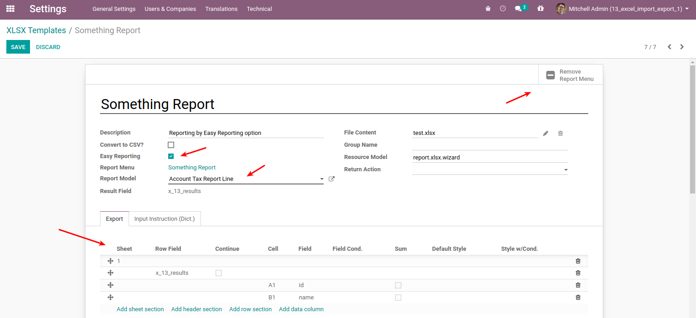

## Concepts

This module contain pre-defined function and wizards to make exporting,
importing and reporting easy.

At the heart of this module, there are 2 main methods

- `self.env['xlsx.export'].export_xlsx(...)`
- `self.env['xlsx.import'].import_xlsx(...)`

For reporting, also call export_xlsx(...) but through following method

- `self.env['xslx.report'].report_xlsx(...)`

After install this module, go to Settings \> Technical \> Excel Import/Export \> XLSX
Templates, this is where the key component located.

As this module provide tools, it is best to explain as use cases. For
example use cases, please install **excel_import_export_demo**

## Use Cases

**Use Case 1:** Export/Import Excel on existing document

This add export/import action menus in existing document (example -
excel_import_export_demo/import_export_sale_order)

1.  Create export action menu on document, \<act_window\> with
    res_model="export.xlsx.wizard" and src_model="\<document_model\>",
    and context\['template_domain'\] to locate the right template --
    actions.xml
2.  Create import action menu on document, \<act_window\> with
    res_model="import.xlsx.wizard" and src_model="\<document_model\>",
    and context\['template_domain'\] to locate the right template --
    action.xml
3.  Create/Design Excel Template File (.xlsx), in the template, name the
    underlining tab used for export/import -- \<file\>.xlsx
4.  Create instruction dictionary for export/import in xlsx.template
    model -- templates.xml

**Use Case 2:** Import Excel Files

With menu wizard to create new documents (example -
excel_import_export_demo/import_sale_orders)

1.  Create report menu with search wizard,
    res_model="import.xlsx.wizard" and context\['template_domain'\] to
    locate the right template -- menu_action.xml
2.  Create Excel Template File (.xlsx), in the template, name the
    underlining tab used for import -- \<import file\>.xlsx
3.  Create instruction dictionary for import in xlsx.template model --
    templates.xml

**Use Case 3:** Create Excel Report

This create report menu with criteria wizard. (example -
excel_import_export_demo/report_sale_order)

1.  Create report's menu, action, and add context\['template_domain'\]
    to locate the right template for this report -- \<report\>.xml
2.  Create report's wizard for search criteria. The view inherits
    `excel_import_export.xlsx_report_view` and mode="primary". In this
    view, you only need to add criteria fields, the rest will reuse from
    interited view -- \<report.xml\>
3.  Create report model as models.Transient, then define search criteria
    fields, and get reporing data into `results` field -- \<report\>.py
4.  Create/Design Excel Template File (.xlsx), in the template, name the
    underlining tab used for report results -- \<report_file\>.xlsx
5.  Create instruction dictionary for report in xlsx.template model --
    templates.xml

**Note:**

Another option for reporting is to use report action
(report_type='excel'), I.e.,

``` xml
<record id="action_report_saleorder_excel" model="ir.actions.report">
        <field name="name">Quotation / Order (.xlsx)</field>
        <field name="model">ir.model</field>
        <field name="report_name">'sale.order'</field>
        <field name="report_file">'sale.order'</field>
        <field name="binding_model_id" ref="sale.model_sale_order"/>
        <field name="binding_type">report</field>
        <field name="report_type">excel</field>
</record>
```

By using report action, Odoo will find template using combination of
model and name, then do the export for the underlining record. Please
see example in excel_import_export_demo/report_action, which shows,

1.  Print excel from an active sale.order
2.  Run partner list report based on search criteria.

## Easy Reporting Option

Technically, this option is the same as "Create Excel Report" use case.
But instead of having to write XML / Python code like normally do, this
option allow user to create a report based on a model or view, all by
configuration only.

1.  Go to Settings \> Technical\> Excel Import/Export \> XLSX Templates, and
    create a new template for a report.
2.  On the new template, select "Easy Reporting" option, then select
    followings
    - Report Model, this can be data model or data view we want to get
      the results from.
    - Click upload your file and add the excel template (.xlsx)
    - Click Save, system will create sample export line, user can add
      more fields according to results model.
3.  Click Add Report Menu, the report menu will be created, user can
    change its location. Now the report is ready to use.

> 

Note: Using easy reporting mode, system will used a common criteria
wizard.

> 
